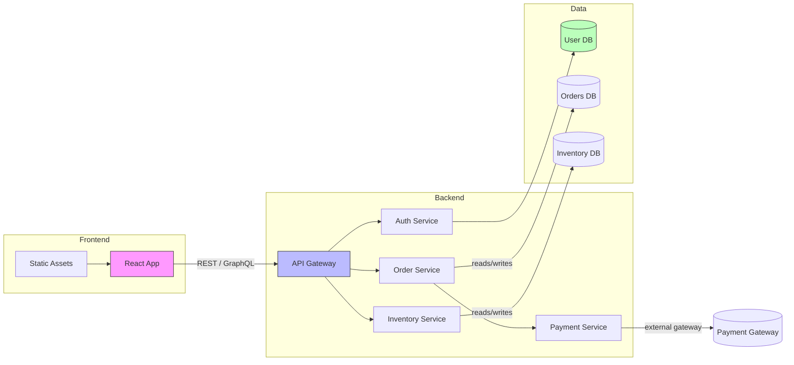

## Fictitious Project Dependency Diagram (Mermaid)

This file demonstrates a simple, fictitious dependency diagram written in Mermaid syntax.



Notes:
- **Previewing in VS Code**: Install one of these extensions and open the Markdown preview:
  - `yzhang.markdown-all-in-one` (general Markdown tooling) + `bierner.markdown-mermaid` or
  - `shd101wyy.markdown-preview-enhanced` (includes Mermaid rendering).
  Then open this file and toggle the Markdown preview (`Ctrl+K V`).
- **On GitHub**: GitHub may render Mermaid diagrams directly in Markdown in some contexts. If your repo doesn't render Mermaid, you can:
  - Use `shd101wyy/markdown-preview-enhanced` locally to export the diagram as SVG, or
  - Use an online Mermaid live editor (https://mermaid.live) to paste the diagram and export an image.

Optional: Replace nodes and edges to match your real project.

### Demo Flow Diagram (Mermaid)

```mermaid
flowchart LR
    subgraph Users
        U[User Browser]
        M[Mobile App]
    end

    subgraph Edge ["Edge / CDN"]
        CDN[CDN / Static Hosting]
        CDN -->|cache| FE[React SPA]
    end

    subgraph App ["Application"]
        FE -->|API calls (REST/GraphQL)| API[API Gateway]
        FE -->|WebSocket| WS[Realtime Socket]
        M --> API
    end

    subgraph AuthAndQueue ["Auth / Queue"]
        API --> Auth[Auth Service (JWT/OIDC)]
        API --> QA[Message Queue (events)]
    end

    subgraph Services ["Backend Services"]
        S1[Order Service]
        S2[Inventory Service]
        S3[Billing Service]
        S4[Notification Service]
    end

    subgraph Data ["Data & Cache"]
        Cache[(Redis Cache)]
        DB[(Primary DB)]
        Search[(Search Index)]
    end

    subgraph Infra ["Integrations & Ops"]
        PaymentGateway[(Payment Gateway)]
        EmailProvider[(Email/SMS)]
        Telemetry[(Monitoring / Logs)]
        CICD[(CI/CD)]
    end

    QA --> Worker[Background Worker]
    Worker --> S1
    S1 --> DB
    S1 --> QA
    S1 --> S2
    S2 --> DB
    S3 --> PaymentGateway
    S1 --> Cache
    API --> Cache
    S4 --> EmailProvider
    WS --> S4

    API --> Telemetry
    Worker --> Telemetry
    CICD -->|deploy| FE
    CICD -->|deploy| Services

    style FE fill:#f9f,stroke:#333,stroke-width:1px
    style API fill:#bbf,stroke:#333,stroke-width:1px
    style DB fill:#bfb,stroke:#333,stroke-width:1px
    style Cache fill:#ffdfba,stroke:#333,stroke-width:1px
```